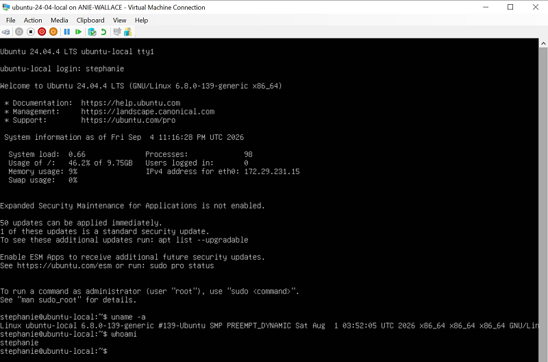

# W2.4 - Local Virtual Machine Using Microsoft Hyper-V

**Author:** Stephanie Wallace  
**Loyola Email:** swallace6@luc.edu  
**GitHub ID:** AnieWall


## Overview

For this assignment, I created a local Ubuntu Server virtual machine on my Windows laptop using Microsoft Hyper-V.

Virtualization allows a physical computer to provide isolated virtual computing environments that behave like independent machines. In this exercise, Windows 10 Pro remained the host operating system while Ubuntu Server 24.04 LTS ran as the guest operating system. Hyper-V provided the abstraction between the physical CPU, memory, storage, networking, and the Ubuntu guest.

This is an example of a system virtual machine, where a complete guest operating system runs using virtualized hardware resources. This concept is also important in cloud computing because virtual machines are a core compute resource in Infrastructure as a Service (IaaS).

The goal of this exercise was to create a minimal VM, log in successfully, verify that Linux was running under Hyper-V, and document any system-specific issues I encountered.

## System Information

My host computer has the following specifications:

- Manufacturer: Dell Inc.
- Model: Dell Latitude 7480
- Host operating system: Microsoft Windows 10 Pro
- Windows version: 10.0.19045
- Processor: Intel Core i5-7200U @ 2.50 GHz
- Physical CPU cores: 2
- Logical processors: 4
- Physical memory: approximately 8 GB
- Hypervisor: Microsoft Hyper-V
- Guest operating system: Ubuntu Server 24.04 LTS

Because my laptop has only 8 GB of physical memory and a dual-core processor, I used a relatively small VM configuration so that the Windows host could remain responsive.

## Prerequisites

I used the following software and resources for this tutorial:

| Requirement | What I Used |
| --- | --- |
| Host operating system | Windows 10 Pro |
| Terminal | Git Bash |
| Hypervisor | Microsoft Hyper-V |
| Guest operating system | Ubuntu Server 24.04 LTS |
| VM disk allocation | 20 GB |
| VM startup memory | 2048 MB |
| Virtual processors | 1 |

Before beginning, download or verify the required software using the official resources listed below.

## Required Resources

- Git for Windows: https://git-scm.com/install/windows
- Course Git Bash instructions: https://github.com/cloudmesh-ai/cloudmesh-ai-lecture/blob/main/docs/section/linux/gitbash.md
- Microsoft Hyper-V: https://learn.microsoft.com/en-us/windows-server/virtualization/hyper-v/get-started/install-hyper-v?tabs=powershell&pivots=windows 
- Ubuntu Server 24.04 LTS: https://ubuntu.com/download/server
- Virtualization concepts: https://cloudmesh-ai.github.io/cloudmesh-ai-lecture/lecture/cloud/virtualization/


## Install and Configure Git Bash

Git Bash is included with Git for Windows.

1. Open the official Git for Windows download page.
2. Download the Windows installer.
3. Open the downloaded `.exe` file.
4. Approve the Windows User Account Control prompt if it appears.
5. Continue through the installer. I used the recommended/default options.
6. Complete the installation and launch Git Bash.

Verify the installation with:

```bash
git --version
```

Git also needs an identity associated with commits. I configured my name and Loyola email using:

```bash
git config --global user.name "Stephanie Wallace"
git config --global user.email "swallace6@luc.edu"
```

The configuration can be verified with:

```bash
git config --global --list
```

On my Windows computer I also confirmed the Git Bash executable existed using PowerShell:

```powershell
Test-Path "C:\Program Files\Git\git-bash.exe"
```

The result was:

```text
True
```

## Enable Microsoft Hyper-V

Microsoft Hyper-V is included as an optional Windows feature on supported editions of Windows 10 Pro and Windows 11 Pro, so a separate Hyper-V installer is not required.

On Windows 10 Pro, Hyper-V can be enabled through the graphical interface:

1. Open **Start**.
2. Open **Settings**.
3. Select **Apps > Apps & features**.
4. Select **Programs and Features**.
5. Select **Turn Windows features on or off**.
6. Check **Hyper-V**.
7. Click **OK**.
8. Restart Windows if prompted.

Hyper-V can alternatively be enabled from an Administrator PowerShell terminal:

```powershell
Enable-WindowsOptionalFeature -Online -FeatureName Microsoft-Hyper-V -All
```

After installation, search for and open **Hyper-V Manager** from the Windows Start menu.

On my computer, Hyper-V had already been enabled before I began the VM installation.

## Download Ubuntu Server

I used Ubuntu Server 24.04 LTS as the guest operating system.

1. Open the official Ubuntu Server download page.
2. Locate the supported Ubuntu 24.04 LTS Server release.
3. Download the 64-bit AMD64 server ISO.
4. Save the ISO somewhere easy to locate, such as the Windows Downloads folder.
5. Do not extract the ISO. Hyper-V uses the ISO directly as a virtual installation DVD.

The ISO is later selected during VM creation under the option to install an operating system from a bootable image file.

## Create the Ubuntu Virtual Machine

In Hyper-V Manager, I selected:

**New > Virtual Machine**

I created a VM named:

```text
ubuntu-24-04-local
```

I used the following configuration:

| Setting | Configuration |
| --- | --- |
| VM name | ubuntu-24-04-local |
| Generation | Generation 2 |
| Startup memory | 2048 MB |
| Dynamic memory | Enabled |
| Virtual processors | 1 |
| Virtual hard disk | 20 GB |
| Network | Default Switch |
| Guest OS | Ubuntu Server 24.04 LTS |

I selected these values because my Dell Latitude 7480 has approximately 8 GB of RAM and only two physical CPU cores. Assigning modest resources allowed both Windows and Ubuntu to operate without placing excessive load on the laptop.

## Install Ubuntu Server

I attached the Ubuntu Server 24.04 LTS ISO file to the virtual DVD drive and started the VM.

During the Ubuntu installation I:

1. Selected the default Ubuntu Server installation.
2. Used the 20 GB virtual hard disk created by Hyper-V.
3. Configured the hostname as `ubuntu-local`.
4. Created a local Linux user account.
5. Installed the OpenSSH server.
6. Completed the installation and rebooted the VM.

## Log In and Verify the VM

After Ubuntu restarted, I logged in with the account created during installation.

My terminal prompt appeared as:

```text
stephanie@ubuntu-local:~$
```

I verified that Linux was running inside Hyper-V using commands such as:

```bash
uname -a
lscpu
free -h
df -h
```

The `lscpu` output identified:

```text
Hypervisor vendor: Microsoft
Virtualization type: full
```

This confirmed that Ubuntu was running as a virtual machine under Microsoft Hyper-V.

## Proof of Successful Login

The screenshot below shows a successful login to the Ubuntu VM and a command executed from the Linux terminal.




## System-Specific Quirks and Problems

### Limited Host Resources

My Dell Latitude 7480 has approximately 8 GB of RAM and a dual-core Intel processor. Because of this, I did not allocate a large amount of memory or CPU resources to the VM.

I used 2048 MB of startup memory, Dynamic Memory, and one virtual processor. Hyper-V later reduced the amount of memory actively assigned to Ubuntu when the VM was lightly loaded, which demonstrated how Dynamic Memory adjusts resources based on demand.

### Ubuntu Reboot Problem

After the Ubuntu installation completed, the VM initially displayed a failure message during reboot.

The Ubuntu installation ISO was still associated with the virtual DVD drive. I opened:

**Hyper-V Manager > VM Settings > SCSI Controller > DVD Drive**

and removed the ISO from the DVD drive.

I then powered the VM off and started it again. Ubuntu successfully booted from the virtual hard disk.

### Secure Boot

Because I used a Generation 2 VM, Secure Boot was enabled. For Ubuntu, the Secure Boot template can be set to:

```text
Microsoft UEFI Certificate Authority
```

### Screenshot Keyboard Capture

While the Hyper-V Virtual Machine Connection window had control of the keyboard, Windows screenshot shortcuts did not always behave normally.

I released focus from the VM and used the Windows Snipping Tool to capture the terminal instead.

## Shutting Down the VM

The VM can be shut down from Ubuntu with:

```bash
sudo shutdown now
```

A graceful shutdown is preferable to using Hyper-V's **Turn Off** option because Turn Off is similar to suddenly removing power from a physical computer.

## What I Learned

This exercise helped me understand virtualization as more than simply installing another operating system on my laptop.

My Dell Latitude 7480 provided the physical CPU, memory, disk, and network resources. Microsoft Hyper-V acted as the hypervisor and abstracted these physical resources so that Ubuntu Server could operate as an independent guest operating system.

The exercise demonstrated one of the major benefits of virtualization: multiple computing environments can use the same physical hardware while remaining logically separated. It also showed why resource allocation matters because every virtual machine ultimately shares the finite resources of the physical host.

This helped me connect local virtualization to cloud computing. Infrastructure as a Service providers use the same general idea at a much larger scale by providing virtualized compute, storage, and networking resources on demand rather than requiring every user to purchase and maintain separate physical servers.

My `lscpu` output also identified Microsoft as the hypervisor vendor and reported the virtualization type as `full`, which provided direct evidence that Ubuntu was running inside a virtualized environment.

## Contributing 

If I discover an error or outdated instruction in the official Cloud Computing lecture notes, I can contribute a correction instead of creating a separate competing tutorial.

The general contribution process is:

1. Fork or obtain access to the lecture-notes repository.
2. Clone the repository locally.
3. Create a new branch for the correction.
4. Edit and test the affected documentation.
5. Commit the changes with a clear commit message.
6. Push the branch to GitHub.
7. Open a pull request explaining the problem and the proposed correction.

The official Cloud Computing lecture-notes repository is:

https://github.com/cloudmesh-ai/cloudmesh-ai-lecture

