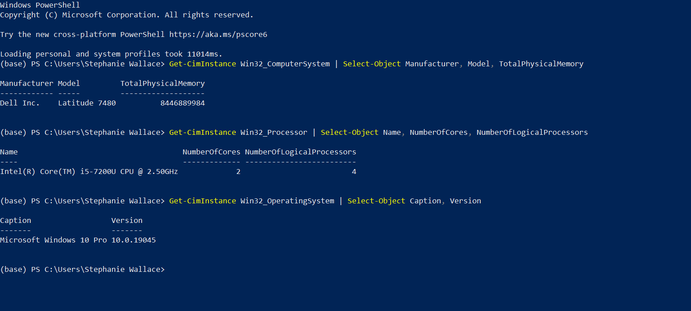
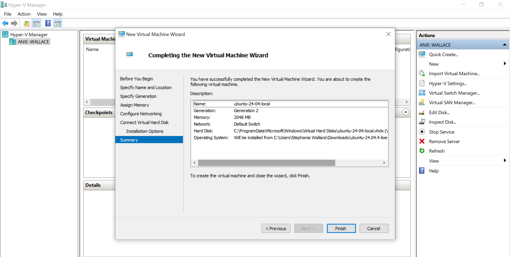
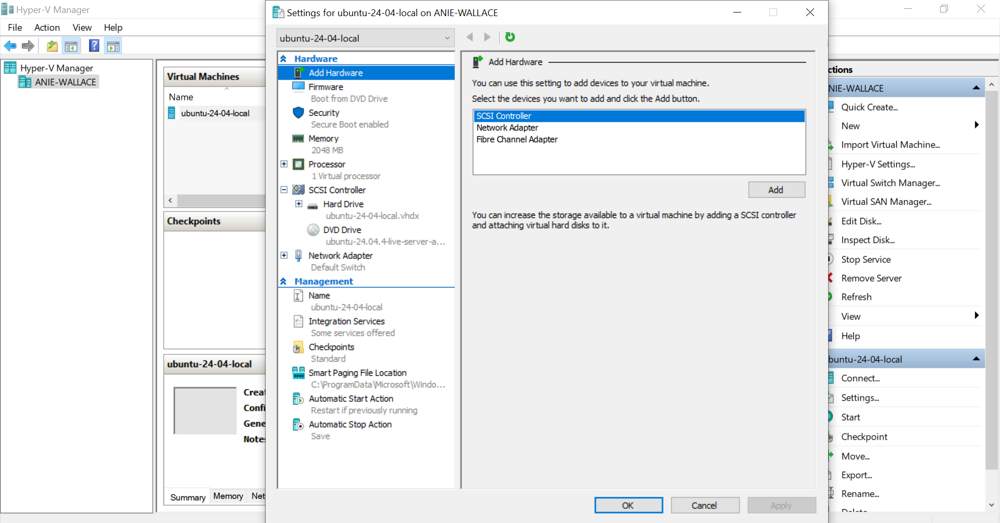
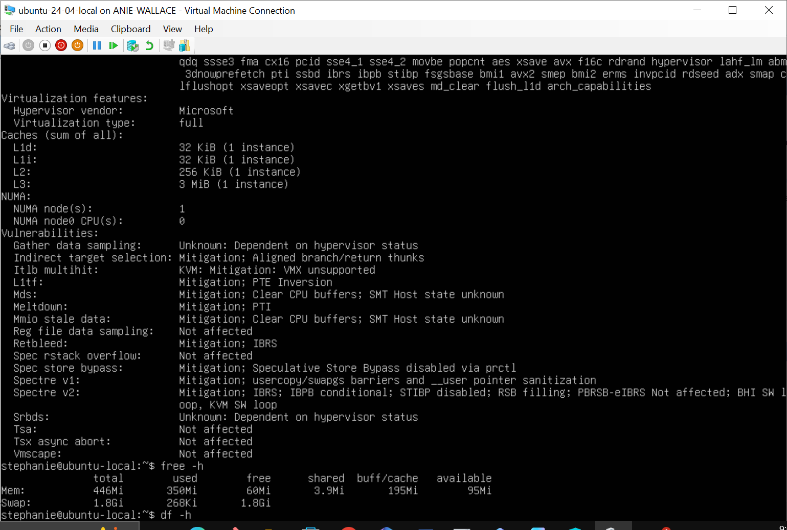

# W2.1 - Creating a Local Virtual Machine Using Hyper-V

## Introduction

For this assignment, I created a virtual machine on my local computer using Microsoft Hyper-V. 
I installed Ubuntu Server 24.04 LTS as the guest operating
system and configured the virtual machine based on the hardware resources available on my laptop.

## Host Computer Specifications

Before creating the virtual machine, I checked the specifications of my
computer using Windows PowerShell.

My host computer has the following specifications:

- Manufacturer: Dell Inc.
- Model: Dell Latitude 7480
- Host operating system: Microsoft Windows 10 Pro
- Processor: Intel Core i5-7200U @ 2.50 GHz
- Physical CPU cores: 2
- Logical processors: 4
- Physical memory: approximately 8 GB
- Hypervisor: Microsoft Hyper-V

The specifications were checked using the following PowerShell commands:

```powershell
Get-CimInstance Win32_ComputerSystem |
Select-Object Manufacturer, Model, TotalPhysicalMemory

Get-CimInstance Win32_Processor |
Select-Object Name, NumberOfCores, NumberOfLogicalProcessors

Get-CimInstance Win32_OperatingSystem |
Select-Object Caption, Version
```



## Opening Hyper-V Manager

I used Microsoft Hyper-V Manager, which was already enabled on my Windows 10 Pro computer.

When I first opened Hyper-V Manager, there were no virtual machines configured. I used this interface to begin creating the Ubuntu virtual machine.



## Creating and Configuring the Virtual Machine

I created a new virtual machine named:

`ubuntu-24-04-local`

I configured the virtual machine using the following settings:

| Settings | Configuration |
| --- | --- |
| Virtual machine name | ubuntu-24-04-local |
| Generation | Generation 2 |
| Startup memory | 2048 MB |
| Dynamic memory | Enabled |
| Virtual processors | 1 |
| Virtual hard disk | 20 GB |
| Network connection | Default Switch |
| Guest operating system | Ubuntu Server 24.04 LTS |

I selected these settings based on the available resources of my Dell Latitude 7480. Since the host computer has approximately 8 GB of RAM, 2 physical CPU cores, and 4 logical processors, I allocated modest resources to the virtual machine so that Windows could continue running normally.

The screenshot below shows the completed Hyper-V configuration for the Ubuntu virtual machine.



## Running Ubuntu in Hyper-V

After completing the Ubuntu Server 24.04 LTS installation, I restarted the virtual machine and logged in using the local account created during setup.

The Ubuntu command-line interface confirmed that the guest operating system was running successfully inside Microsoft Hyper-V.

I used the following Linux commands to verify the virtual environment:

```bash
lscpu
free -h
df -h
```
The `lscpu` output showed that the **Hypervisor vendor was Microsoft** and the **virtualization type was full**, confirming that Ubuntu was running as a virtual machine under Microsoft Hyper-V.

The `free -h` command displayed the memory available to the Ubuntu virtual machine, while `df -h` displayed the virtual disk and filesystem information.

The screenshot below shows Ubuntu Server 24.04 LTS running successfully inside the Hyper-V virtual machine.



## Conclusion

This assignment showed me how a complete guest operating system can run inside a virtualized environment on a local computer.

Microsoft Hyper-V provided virtual CPU, memory, storage, and networking resources to Ubuntu while Windows 10 continued running as the host operating system.

Because my Dell Latitude 7480 has approximately 8 GB of RAM and a dual-core processor, I configured the Ubuntu virtual machine with modest resources to avoid placing unnecessary load on the host computer.

The completed Ubuntu installation and verification commands confirmed that the virtual machine was successfully created and operating under Microsoft Hyper-V.

